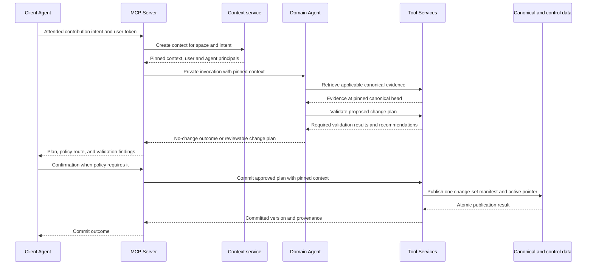
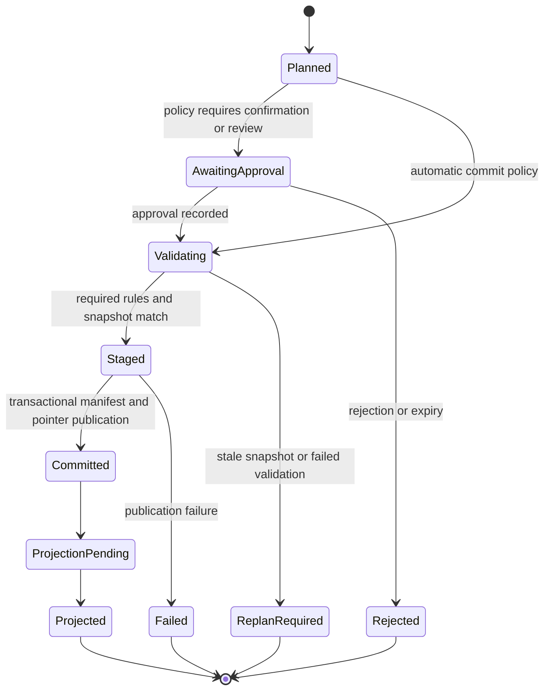
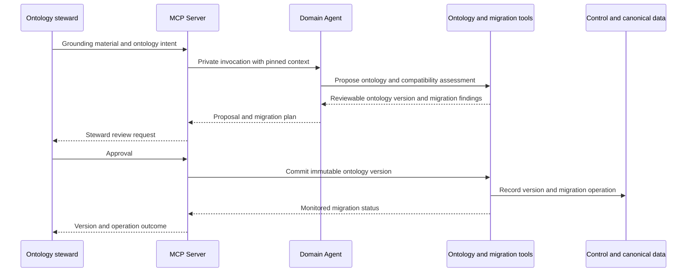
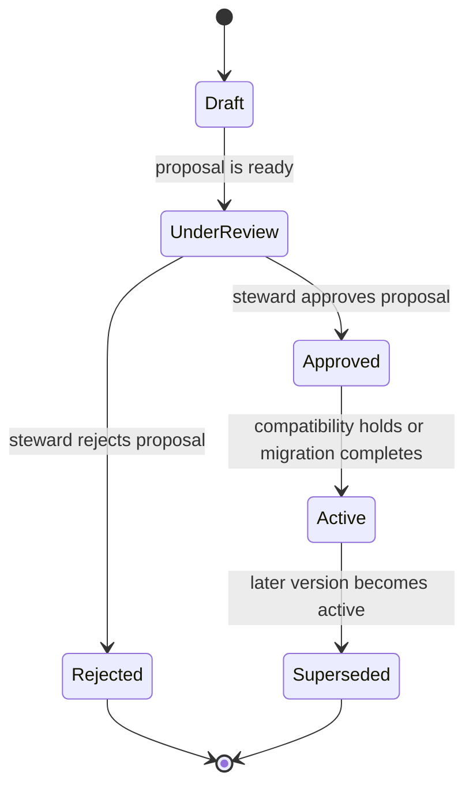
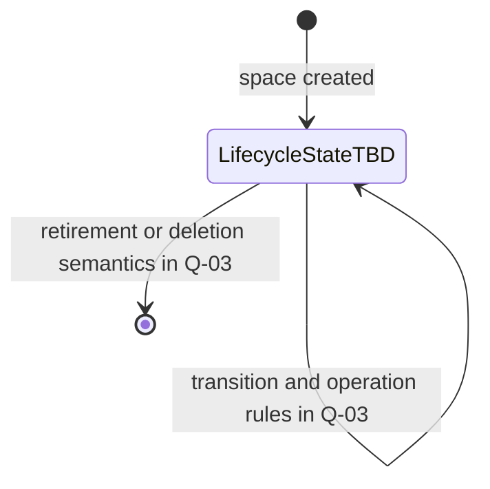
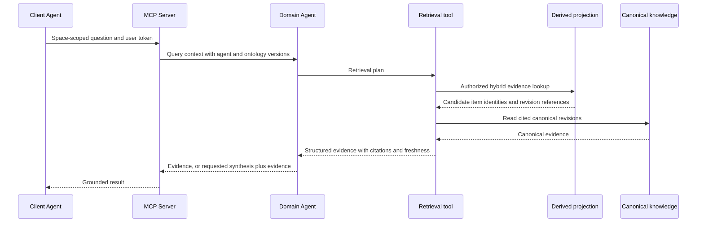
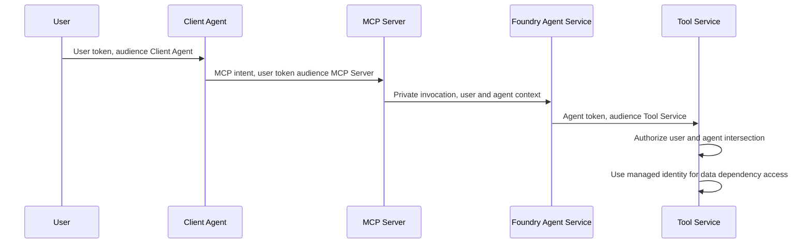
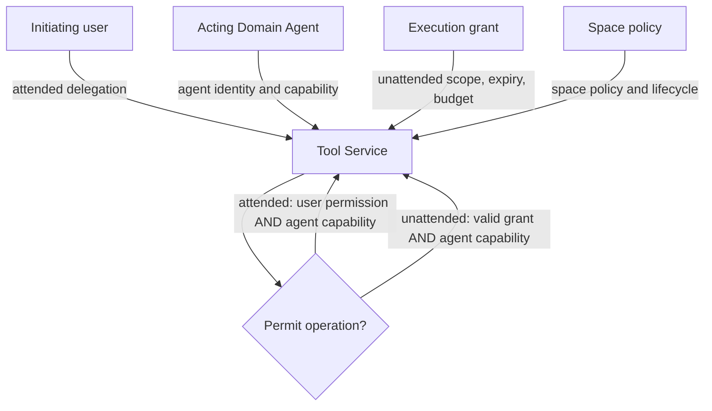

## Agentic execution model

## Purpose

Define how Our IQ resolves intent without exposing canonical knowledge CRUD.
This is a proposed architectural design based on accepted ADRs. It does not
describe deployed behaviour or public MCP contracts.

## Execution boundaries

The Our IQ MCP Server receives authenticated, space-scoped intent. It creates
an immutable execution-context snapshot and invokes a shared, versioned Our IQ
Domain Agent. The agent interprets intent and calls narrow private tools. Tool
Services, rather than the agent, enforce authorization, validation, canonical
publication, and audit.

```mermaid
flowchart LR
  client[Client Agent]
  mcp[Our IQ MCP Server]
  context[Execution-context service]
  agent[Our IQ Domain Agent]
  tools[Our IQ Tool Services]
  control[(Cosmos DB control metadata)]
  canonical[(Canonical Markdown revisions)]
  projection((Search and graph projections))

  client -->|MCP intent and user token| mcp
  mcp -->|space, user, agent context| context
  context -->|immutable execution-context snapshot| agent
  agent -->|private planning or retrieval tool call| tools
  tools -->|transactional control records| control
  tools -->|immutable staged or committed revision| canonical
  canonical -.|rebuild or incremental projection input| projection
```

The public boundary ends at the MCP Server. Private tool calls are not public
tools, and no public operation directly creates, reads, updates, or deletes a
knowledge item.

## Execution-context snapshot

Every attended request and unattended job receives an immutable snapshot before
agent reasoning begins. It contains:

| Context element | Purpose |
| --- | --- |
| Execution ID and trace ID | Correlate the request, agent invocation, tools, jobs, and audit records. |
| Knowledge-space ID and lifecycle state | Scope all operations and determine if the requested operation is permitted. |
| Domain Agent definition version | Make agent behaviour attributable and evaluable. |
| Active ontology ID, version, and content digest | Bind planning and validation to one immutable ontology interpretation. |
| Mutation-policy version | Bind a plan to the policy evaluated for it. |
| Canonical head version | Detect a plan produced against superseded canonical state. |
| Identity context | Preserve the initiating user for attended work and the acting agent for every execution. |
| Execution grant, when unattended | Prove the bounded authorization for work without a user session. |

Tool Services require the snapshot identifier on state-sensitive calls. They
reject a mutation when the target space lifecycle, active ontology, policy, or
canonical head no longer matches the snapshot. The caller must obtain a new
snapshot and re-plan; tools never silently retarget a plan to current state.

## Attended contribution and change-set publication

An agent may conclude that a contribution needs no canonical change. Otherwise,
it produces a reviewable change plan. The policy selected by the snapshot
determines whether the plan commits automatically, needs contributor
confirmation, or enters review. Approval evidence becomes part of the
change-set provenance.



### Transactional visibility fence

Each proposed knowledge-item revision is written as an immutable staged
revision. Staged revisions are not canonical and are not visible to normal
readers. A per-space Cosmos DB transactional batch publishes the change-set
manifest, provenance, and next active revision pointer together. That pointer
is the visibility fence: readers first resolve it, then read only the immutable
revisions enumerated by the committed manifest.



Projection work is separate from canonical publication. A projection can lag or
fail without rolling back a committed change set. Retrieval may therefore
report projection freshness and, where necessary, use canonical fallback
behaviour defined by the later API-contract design.

## Ontology creation and migration

Ontology management remains agent-mediated. An ontology proposal is reviewable
before its immutable version is committed. If compatibility checks find affected
knowledge, the resulting migration plan is a monitored operation and receives
its own execution context and, when unattended, execution grant.





Knowledge-space legal lifecycle states and transitions remain Q-03. The design
does not invent them. The execution context always carries the current
lifecycle state, and tools gate operations against the transition rules once
they are approved.



## Retrieval and optional synthesis

Retrieval uses the pinned context to scope evidence to one knowledge space and
authorize it before return. The default outcome is structured grounded evidence
and canonical citations. Narrative synthesis is an explicit agent request and
does not replace the cited evidence.



## Identity, authorization, and unattended execution

Authorization is evaluated by Tool Services at the knowledge-space boundary.
For attended work it intersects the initiating user's permissions with the
acting Domain Agent's permitted capability. The service's managed identity is
used only to reach platform dependencies and is not an authorization principal.





An unattended execution has no user delegation. It must instead present an
immutable execution grant recorded in control metadata. The grant names the
space, operation scope, agent definition or capability, issuing attended
approval or space policy, validity interval, and applicable execution limits.
Every private tool call verifies the grant has not expired, been revoked, or
exceeded its scope. Grant creation, use, revocation, and expiry are auditable.

## Privileged deterministic correction

A steward or operator may submit a management operation against a known
knowledge-item identity. This bypasses agent interpretation, not governance.
The management path still creates a context snapshot, authorizes the privileged
capability, applies required ontology checks where relevant, records a reason,
and publishes through the same visibility fence.

## Agent evaluation and rollout gates

Each Domain Agent definition, prompt, or model change is evaluated before
rollout against versioned representative cases. A case contains the source
material, pinned context, expected change-set shape or no-change outcome,
required validation result, expected evidence/citation assertions, and
permitted-tool expectations.

| Gate | Required assertion |
| --- | --- |
| Planning | The proposed change-set shape only changes intended items and uses the pinned ontology. |
| Grounding | Retrieved evidence cites the expected canonical revisions and does not claim unsupported facts. |
| Governance | The plan follows the snapshot mutation policy and produces the expected approval route. |
| Safety | Untrusted content cannot alter agent instructions, context contents, or permitted private tools. |
| Regression | Results are compared with the approved baseline for the same agent definition version. |

Evaluation cases are governance artefacts, not a claim that a particular model
or test framework has been selected. Model selection and prompt-governance
ownership remain open.

## Worked execution outcomes

| Situation | Expected outcome |
| --- | --- |
| A contribution is already represented by cited canonical knowledge. | The Domain Agent returns a no-change outcome with the evidence considered. |
| A plan omits a Required ontology field. | Validation blocks commitment; the plan identifies the missing field. |
| A plan does not follow a Recommended hierarchy convention. | The plan surfaces the recommendation. An authorized reviewer may approve with recorded rationale. |
| Canonical state changes after planning. | Tools reject the stale commit and require a new snapshot and re-plan. |
| A weekly maintenance job begins after its grant expires. | Tools deny the call and record the expired-grant outcome. |

## Related decisions and open questions

- [ADR-0002](../decisions/adr-0002-agent-mediated-intent-interface) defines
  the public intent boundary.
- [ADR-0015](../decisions/adr-0015-transactional-change-set-visibility-fence)
  defines canonical publication.
- [ADR-0016](../decisions/adr-0016-immutable-execution-context-snapshots)
  defines invocation pinning.
- Public request and response shapes, idempotency, errors, and the precise
  evidence schema remain for the API-contract slice.
