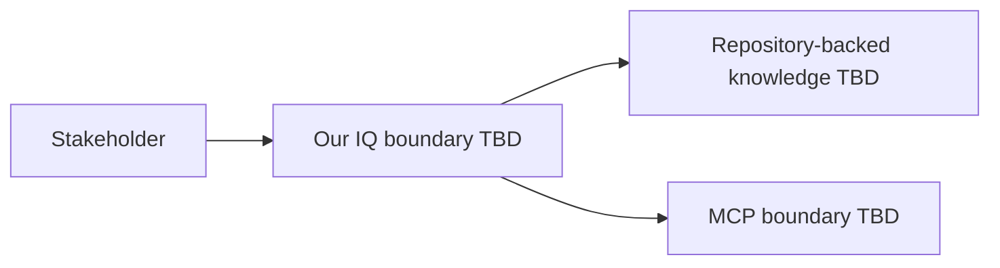

## 3. System scope and context

## Purpose

Define the system boundary and external context before designing internal
components.

## System boundary

The boundary is not approved. The current repository represents design work,
not a running system.

## Context map

## Open questions

- Which people, systems, repositories, or providers are external actors?
- What crosses each boundary?
- Which source remains authoritative?
