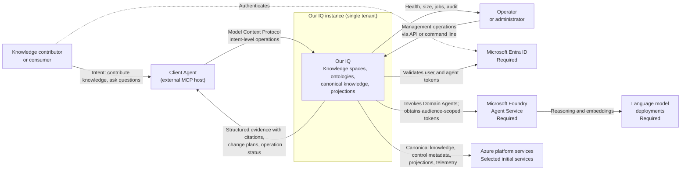

## 3. System scope and context

## Purpose

Define the system boundary and the external actors and systems Our IQ interacts
with, before describing anything internal.

This section is `Proposed`. It describes the intended boundary. No part of it is
implemented.

## System boundary

Our IQ is one single-tenant instance hosting multiple knowledge spaces. Inside
the boundary are the public protocol surface, the backend agents that resolve
intent, the services that hold canonical knowledge and its projections, and the
management surfaces used to operate the instance.

Outside the boundary are the agents and people that use Our IQ, the identity
provider that authenticates them, the agent runtime that hosts Our IQ's agents,
and the platform services Our IQ depends on.

Our IQ is authoritative for the knowledge contributed to it. It is not
authoritative for data owned by another system.

## Business context

| Partner | Direction | What crosses the boundary |
| --- | --- | --- |
| Client Agent | Inbound | Knowledge contributions expressed as intent; questions; knowledge-space and ontology enquiries |
| Client Agent | Outbound | Structured evidence with citations; change plans awaiting confirmation; operation status; errors |
| Knowledge contributor | Inbound | Authentication; approval or rejection of a change plan |
| Ontology steward | Inbound | Grounding material describing the team's domain; approval of an ontology version and its migration plan |
| Space administrator | Inbound | Role assignments; mutation policy; lifecycle actions |
| Instance administrator | Inbound | Knowledge-space creation; instance policy |
| Operator | Inbound | Maintenance commands; job cancellation |
| Operator | Outbound | Health, size, job status, audit records, diagnostics |

Contributors, stewards, administrators, and operators reach Our IQ either
through a Client Agent or through the management surfaces, not by editing
storage directly.

## Technical context

| External system | Relationship | What crosses the boundary |
| --- | --- | --- |
| Microsoft Entra ID | Required | Authenticates human users and issues the agent identities under which Our IQ's agents act |
| Microsoft Foundry Agent Service | Required | Hosts Our IQ Domain Agents; performs the token exchange that lets an agent call Our IQ's private services |
| Language model deployments | Required | Reasoning and embedding capability consumed by the Domain Agents |
| Azure platform services | Required | Canonical storage, control metadata, retrieval projection, messaging, and observability |
| Client Agent host | External | Speaks Model Context Protocol to the Our IQ MCP Server |

Cosmos DB is selected for control metadata and per-space transactional
publication. Azure Blob Storage is selected for canonical revisions, and Azure
AI Search is selected for the initial retrieval projection. Application Insights
and Azure Monitor are selected for telemetry. Long-running work remains open
beyond the synchronous thin slice.

## Context diagram

## What Our IQ deliberately does not do

- It does not synchronize knowledge from or to an external repository or wiki.
- It does not expose knowledge documents for direct editing by its public
  interface consumers.
- It does not serve knowledge to unauthenticated callers.
- It does not span more than one knowledge space in a single retrieval
  operation.

## Open questions

- Does any external system need to read Our IQ knowledge without going through
  the Model Context Protocol surface?
- Are language model deployments owned by Our IQ or supplied by the hosting
  organization?
- Does the instance need to interoperate with an existing wiki or document
  management system during adoption?
- Which external systems, if any, must receive notifications when knowledge
  changes?
