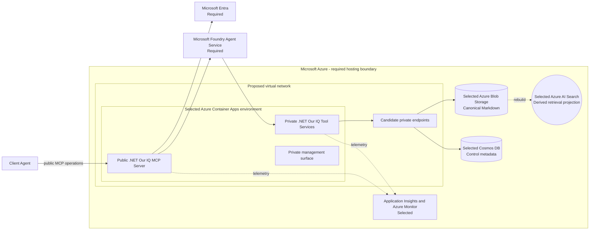

## C4 initial Azure deployment

## Purpose

Map the accepted Azure hosting constraint and selected initial services to
compute, data, and network boundaries. This view is `Proposed`; no Azure
environment is deployed.

## Status and constraints

| Element | Status | Rationale |
| --- | --- | --- |
| Microsoft Azure | Required | CON-08 requires Azure hosting. |
| Microsoft Foundry Agent Service | Required | [ADR-0005](../../decisions/adr-0005-foundry-agent-runtime) requires the backend agent runtime. |
| Microsoft Entra | Required | [ADR-0007](../../decisions/adr-0007-agent-identity-and-execution-context) requires distinct user and agent identity context. |
| Azure Container Apps | Selected | Separate public MCP Server and private Tool Services deployables preserve trust and identity boundaries. |
| Virtual network and private endpoints | Candidate | Candidate private connectivity boundary for supported data services. |
| Azure Blob Storage | Selected | Immutable canonical Markdown and referenced asset store under ADR-0022. |
| Cosmos DB | Selected | Per-space transactional control metadata and change-set coordination. |
| Azure AI Search | Selected | Hybrid derived retrieval projection under ADR-0022. |
| Application Insights and Azure Monitor | Selected | OpenTelemetry is the application and infrastructure telemetry path; retention and alert thresholds remain environment-specific. |

## Explicitly not proposed

The pilot uses one deployment-configured Azure geography and accepts only
non-sensitive synthetic or internal test data. This view does not select a
region, subscription, resource group, network address space, firewall policy,
scaling rule, or service-specific private-endpoint configuration.

## Open questions

- Which Azure service coordinates long-running work after the synchronous thin
  slice (Q-24)?
- Which production residency, classification, retention, and isolation
  constraints apply beyond the pilot boundary (Q-21)?
- Which production observability retention, alert thresholds, and workbook
  scopes satisfy the requirements?
