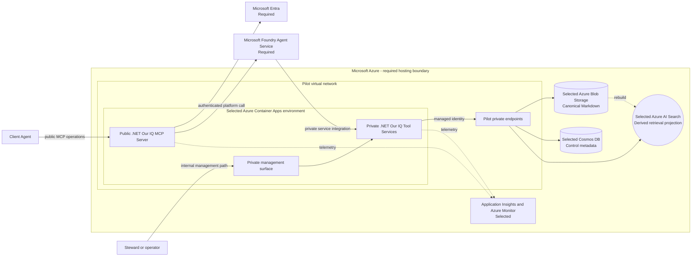

## C4 pilot Azure deployment

## Purpose

Map the accepted Azure hosting constraint and selected initial services to
compute, data, and network boundaries. This view is `Proposed`; no Azure
environment is deployed.

## Status and constraints

| Element | Status | Rationale |
| --- | --- | --- |
| Microsoft Azure | Required | CON-08 requires Azure hosting. |
| Microsoft Foundry Agent Service | Required | [ADR-0005](../../decisions/adr-0005-foundry-agent-runtime) requires the backend agent runtime. |
| Microsoft Entra | Required | [ADR-0007](../../decisions/adr-0007-agent-identity-and-execution-context) requires distinct user and agent identity context. |
| Azure Container Apps | Selected | Separate public MCP Server and private Tool Services deployables preserve trust and identity boundaries. |
| Pilot virtual network and private endpoints | Selected for pilot | One VNet-integrated application boundary with private endpoints for supported data services. |
| Azure Blob Storage | Selected | Immutable canonical Markdown and referenced asset store under ADR-0022. |
| Cosmos DB | Selected | Per-space transactional control metadata and change-set coordination. |
| Azure AI Search | Selected | Hybrid derived retrieval projection under ADR-0022. |
| Application Insights and Azure Monitor | Selected | OpenTelemetry is the application and infrastructure telemetry path; retention and alert thresholds remain environment-specific. |

## Pilot topology

The pilot has one non-production Azure environment in one deployment-configured
geography. The public MCP Server is the only application with external HTTPS
ingress. Tool Services and the management surface use internal ingress only.
The application subnet and private-endpoint subnet are modeled as separate
logical roles; their address spaces and CIDRs remain deployment parameters.

Blob Storage, Cosmos DB, and Azure AI Search use private endpoints where
supported, with private DNS resolution and public network access disabled in the
pilot configuration. Tool Services access those services with their own managed
identity. Foundry Domain Agents reach Tool Services through the supported
private service integration, and the pilot does not expose Tool Services
publicly as a fallback.

## Explicitly not proposed

The pilot uses one deployment-configured Azure geography and accepts only
non-sensitive synthetic or internal test data. This view does not select a
region, subscription, resource group, network address space, production firewall
or egress policy, scaling rule, telemetry isolation, or production
private-endpoint coverage. The selected pilot shape does not claim that an Azure
environment has been deployed.

## Open questions

- Which Azure service coordinates long-running work after the synchronous thin
  slice (Q-24)?
- Which production residency, classification, retention, and stronger isolation
  constraints apply beyond the pilot boundary (Q-21)?
- Which production observability retention, alert thresholds, and workbook
  scopes satisfy the requirements?
