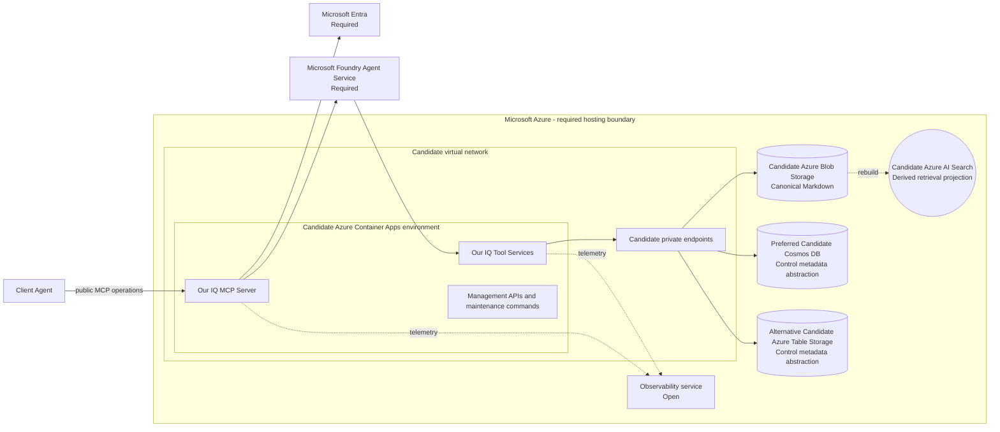

## C4 candidate Azure deployment

## Purpose

Map the accepted Azure hosting constraint to candidate compute, data, and
network boundaries. This view is `Proposed`; no Azure environment is deployed
or selected by this documentation.

## Status and constraints

| Element | Status | Rationale |
| --- | --- | --- |
| Microsoft Azure | Required | CON-08 requires Azure hosting. |
| Microsoft Foundry Agent Service | Required | [ADR-0005](../../decisions/adr-0005-foundry-agent-runtime) requires the backend agent runtime. |
| Microsoft Entra | Required | [ADR-0007](../../decisions/adr-0007-agent-identity-and-execution-context) requires distinct user and agent identity context. |
| Azure Container Apps | Candidate | Candidate compute for API, MCP Server, Tool Service, and management workloads. |
| Virtual network and private endpoints | Candidate | Candidate private connectivity boundary for supported data services. |
| Azure Blob Storage | Candidate | Candidate canonical-knowledge store under [ADR-0009](../../decisions/adr-0009-canonical-markdown-and-rebuildable-projections). |
| Cosmos DB | Preferred Candidate | Preferred initial control-metadata backing store behind a storage abstraction. |
| Azure Table Storage | Alternative Candidate | Alternative control-metadata backing store pending Q-24. |
| Azure AI Search | Candidate | Candidate derived retrieval projection. |
| Observability service | Open | Service selection and retention are not decided. |

## Explicitly not proposed

This view does not propose an Azure region, subscription, resource group,
environment tier, network address space, firewall policy, resource count,
scaling rule, or service-specific private-endpoint configuration.

## Open questions

- Which Azure services finalize control metadata and long-running-work
  orchestration (Q-24)?
- Which regional, residency, classification, retention, and isolation
  constraints apply (Q-21)?
- Which observability service and audit-retention approach satisfy the
  requirements?
