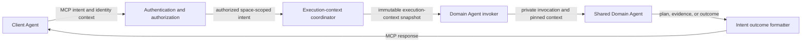
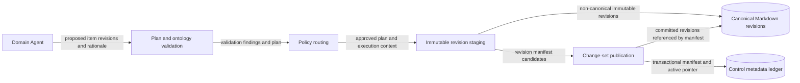
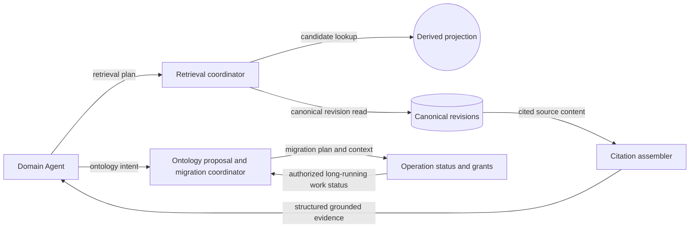

## C4 component view

## Purpose

Show the proposed responsibility boundaries within the public MCP Server and
private Tool Services. These are logical components, not deployed units or
public contracts.

## Public orchestration

| Component | Responsibility | Collaborators |
| --- | --- | --- |
| Authentication and authorization | Validate inbound identity and authorize public intent at the space boundary. | Microsoft Entra ID; execution-context coordinator |
| Execution-context coordinator | Create immutable snapshots that pin state for an invocation. | Control metadata; Domain Agent invoker |
| Domain Agent invoker | Invoke a versioned shared Domain Agent with private context. | Microsoft Foundry Agent Service |
| Intent outcome formatter | Return change plans, cited evidence, operation status, or errors without exposing document CRUD. | Client Agent |

## Contribution and change-set handling

| Component | Responsibility | Collaborators |
| --- | --- | --- |
| Plan and ontology validation | Evaluate Required, Recommended, and Informational rules against the pinned ontology. | Domain Agent; policy routing |
| Policy routing | Choose automatic commit, confirmation, or review and retain approval evidence. | Control metadata; management path |
| Immutable revision staging | Persist non-canonical candidate revisions. | Canonical Markdown revisions |
| Change-set publication | Publish a complete manifest and active pointer through the visibility fence. | Cosmos DB control metadata |

## Retrieval and ontology lifecycle

| Component | Responsibility | Collaborators |
| --- | --- | --- |
| Retrieval coordinator | Obtain authorized candidate knowledge and verify canonical citation sources. | Derived projections; canonical revisions |
| Citation assembler | Build structured grounded evidence defined by the API contract baseline. | Retrieval coordinator; Domain Agent |
| Ontology proposal and migration coordinator | Create reviewable ontology proposals and governed migration plans. | Domain Agent; operation status |
| Operation status and grants | Track long-running work and validate bounded unattended authority. | Control metadata; Tool Services |

## Related views

- [Agentic execution model](../agentic-execution-model) defines the runtime
  flows, identity-sensitive hops, and state lifecycle.
- [Logical knowledge model](../logical-knowledge-model) defines the canonical
  item and ontology-rule semantics.
- The [API contract baseline](../api-contract-baseline) binds initial private
  tools to the three Domain Agent definitions. Logical Tool Service components
  share one private deployable for the pilot.
