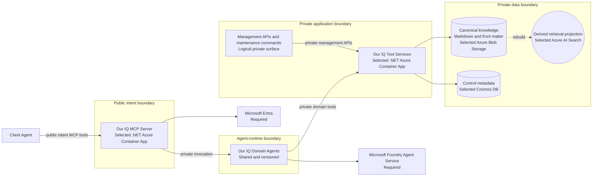

## C4 container view

## Purpose

Show the major deployable or independently meaningful parts inside the system
boundary after they are decided.

This view is `Proposed`. It applies the selected initial implementation services
without claiming that a deployment exists.

**Notation:** rounded database shapes represent authoritative canonical or
control data. Double-circle shapes represent derived, rebuildable projections.
Solid arrows are request or private service calls; dotted arrows are rebuild
flows. A projection may lag a canonical commit and is never authoritative.

| Container | Responsibility | Technology | Status |
| --- | --- | --- | --- |
| Our IQ MCP Server | Public intent-level MCP operation handling. | .NET, ASP.NET Core, official MCP C# SDK, Azure Container Apps | Selected |
| Our IQ Domain Agents | Agent-mediated contribution, retrieval, and ontology reasoning. | Microsoft Foundry Agent Service | Required |
| Our IQ Tool Services | Deterministic private domain operations and data coordination. | .NET, ASP.NET Core, Azure Container Apps | Selected |
| Management APIs and maintenance commands | Privileged operator and steward capability. | Logical surface in private Tool Services | Selected for pilot |
| Canonical knowledge store | Stores authoritative Markdown and front matter. | Azure Blob Storage | Selected |
| Control metadata store | Stores governance and per-space change-set coordination metadata. | Cosmos DB | Selected |
| Retrieval projection | Supports hybrid retrieval and ontology-declared filters and relationships. | Azure AI Search | Selected |

## Deferred questions

- Which logical Tool Service requires a separate deployable after pilot
  measurements?
- Is a dedicated graph projection justified after Azure AI Search relationship
  filtering is evaluated (D-08)?
- Which selected services require additional private-connectivity controls under
  the production policy in ADR-0030?
