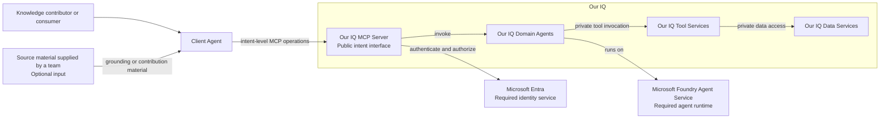

## C4 system context

## Purpose

Show Our IQ, its users, and external systems without assuming internal
technology.

This view is `Proposed`. It is based on accepted decisions and confirmed
constraints, not a deployed system.

The Client Agent is the public consumer. Microsoft Entra and Microsoft Foundry
Agent Service are confirmed external systems. Source material is an optional
input, not an integration with a named external system.

## Open questions

- What management clients and operational integrations require explicit
  context-level relationships?
- Which external source integrations, if any, belong in scope after the
  deferred bulk-import decision is revisited?
