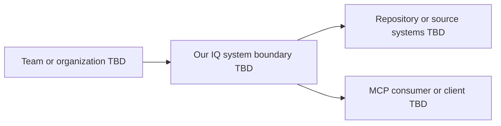

## C4 system context

## Purpose

Show Our IQ, its users, and external systems without assuming internal
technology.

## Open questions

- Who are the system users?
- Which external systems are in scope?
- Which relationships are authoritative?
