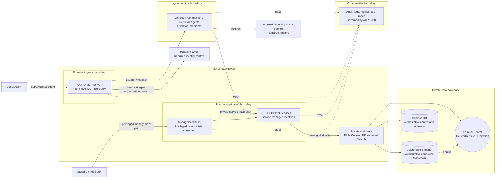

## C4 trust boundaries and data flow

## Purpose

Show the pilot public, agent-runtime, private application, data, management, and
observability boundaries. This `Proposed` view describes the selected pilot
shape and desired controls; it does not describe a deployed network or security
configuration.

## Boundary rules

| Boundary | Permitted flow | Constraint |
| --- | --- | --- |
| External ingress | Client Agent to public intent MCP tools | The MCP Server is the only externally reachable application surface; no public document or ontology CRUD. |
| Agent runtime | MCP Server to Domain Agents; Domain Agents to private Tool Services | Immutable instructions and fixed tool manifests cannot be altered by content. |
| Internal application | Tool and management operations to private data dependencies | Tool Services and management have internal ingress only; Tool Services use their own managed identities. |
| Data | Canonical and control writes; projection rebuilds through private endpoints | Canonical writes are atomic, versioned change sets; projections are non-authoritative. |
| Management | Privileged correction or removal of an identified document through internal ingress | Subject to policy, authorization, versioning, and audit. |
| Observability | Traces, metrics, logs, and audit evidence from every major flow | Audit policy, data minimization, and retention follow ADR-0030; service and alert rules remain implementation work. |

## Pilot environment boundary

The pilot defines local Aspire orchestration and one non-production Azure
environment as its environment tiers. The Azure environment uses one
VNet-integrated Container Apps environment, an application subnet, and a
private-endpoint subnet. Subscription, geography, address spaces, and CIDRs are
deployment parameters. Production environments remain future work and require
the classification, residency, retention, audit, backup, and private-connectivity
evidence defined by ADR-0030.

## Deferred questions

- How are grant issuance, revocation, and execution limits represented in the
  eventual management contract?
