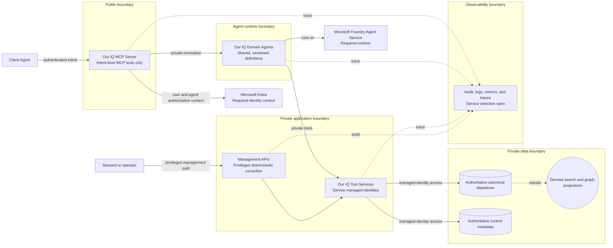

## C4 trust boundaries and data flow

## Purpose

Show the public, agent-runtime, private application, data, management, and
observability boundaries. This `Proposed` view describes desired controls; it
does not describe a deployed network or security configuration.

## Boundary rules

| Boundary | Permitted flow | Constraint |
| --- | --- | --- |
| Public | Client Agent to public intent MCP tools | No public document or ontology CRUD. |
| Agent runtime | MCP Server to Domain Agents; Domain Agents to private Tool Services | Agent content is untrusted input and must not alter instructions or tool permissions. |
| Private application | Tool and management operations to data dependencies | Tool Services use their own managed identities. |
| Data | Canonical and control writes; projection rebuilds | Canonical writes are atomic, versioned change sets; projections are non-authoritative. |
| Management | Privileged correction or removal of an identified document | Subject to policy, authorization, versioning, and audit. |
| Observability | Traces, metrics, logs, and audit evidence from every major flow | Retention, service, and alert rules remain open. |

## Open questions

- How are prompt-injection controls enforced at each agent-processing boundary
  (Q-07)?
- What storage and retention controls apply to audit and observability data
  (Q-21)?
- How is unattended authority represented and validated across boundaries
  (Q-05)?
