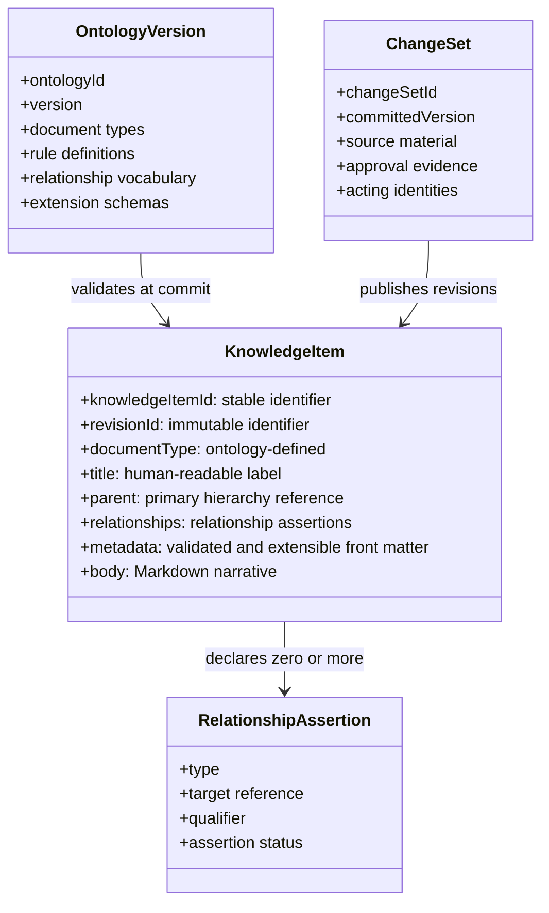

## Logical knowledge model

## Purpose

Define the canonical knowledge-item contract and the ontology rules that guide
its use. This is a proposed, wiki-oriented model: it preserves useful
structure and provenance without treating a shared second brain as a rigid
relational database.

## Model principles

- Markdown body content is the human-readable canonical narrative.
- Structured front matter provides stable identity, retrieval metadata,
  hierarchy, relationships, and provenance links.
- An ontology describes the expected shape and guidance for a knowledge space.
  It does not require every useful connection to be a mandatory foreign key.
- A relationship is an explicit knowledge assertion. Only rules intentionally
  marked Required block a change set.
- Canonical revisions are immutable. A committed change set selects the active
  revision of each changed item.



## Canonical front-matter contract

The following example is illustrative. Field names and public representations
remain subject to the API-contract slice.

```yaml
---
knowledge_item_id: ki-product-decisions
revision_id: rev-2026-08-18-001
document_type: decision-record
title: Prefer evidence before synthesis
primary_parent:
  knowledge_item_id: ki-product
relationships:
  - type: supports
    target:
      knowledge_item_id: ki-grounded-evidence
    note: Explains the default response behaviour.
  - type: related-to
    target:
      unresolved_concept: retrieval usability
    note: A useful connection to refine later.
metadata:
  status: accepted
  tags:
    - retrieval
    - trust
extensions:
  example.org:
    owner_group: knowledge-stewards
provenance:
  change_set_id: cs-2026-08-18-015
  ontology_version: ontology-product-v3
---
```

`knowledge_item_id` remains stable across revisions. `revision_id` identifies
the immutable content selected by a change-set manifest. `primary_parent`
expresses one navigable placement, not exclusive semantic ownership. A
relationship may target a canonical item, an external reference defined by the
ontology, or an explicitly unresolved concept. This permits incomplete and
evolving knowledge to be represented honestly.

## Ontology rule levels

Each ontology rule declares its enforcement level and a human-readable
rationale. The level communicates how agents, reviewers, and validators must
act; it does not measure the importance of the underlying knowledge.

| Level | Commit effect | Typical use |
| --- | --- | --- |
| Required | A violated rule blocks a change set. | Stable ID syntax, a supported document type, required metadata, a Required relationship target, or an allowed extension schema. |
| Recommended | A violation is returned in the plan or review. An authorized approval may proceed only with recorded rationale. | Preferred parent, suggested relationship, recommended tag, or expected stewardship field. |
| Informational | It guides agent planning, retrieval, and review but never blocks or requires override rationale. | Naming guidance, examples, vocabulary notes, and prompts to consider related knowledge. |

This distinction lets an ontology provide useful "guidelines" where discovery
and context matter, while preserving hard protections around the information
that must remain interpretable and governable.

## Relationship and extension semantics

The ontology owns a vocabulary of relationship types and can define each type
as Required, Recommended, or Informational. It may constrain direction,
cardinality, target document types, or qualifiers when that constraint is
useful. A generic `related-to` relationship remains available for meaningful
but weakly specified connections.

Canonical item references in Required relationships must resolve at commit.
Generic relationships may instead use an external reference or an
`unresolved_concept`, with a label and optional note. They are recorded as
assertions rather than rejected for lacking a destination item. A later
contribution can replace an unresolved concept with a canonical item reference
through a normal change set.

Extensions use declared namespaces. An ontology may make a namespace Required,
Recommended, or Informational and can supply a schema for it. Undeclared
top-level fields are rejected so front matter remains interpretable; flexible
team-specific content belongs in an approved extension namespace or in the
Markdown body.

## Reading, writing, and update rules

```mermaid
flowchart LR
  intent[Intent or management request]
  plan[Change plan at pinned snapshot]
  rules[Ontology rule evaluation]
  staged[Immutable staged revisions]
  fence[Committed manifest and active pointer]
  readers[Canonical readers]
  projections((Derived projections))

  intent -->|agent interpretation or deterministic targeting| plan
  plan -->|Required, Recommended, Informational findings| rules
  rules -->|approved and snapshot-valid plan| staged
  staged -->|per-space transactional publication| fence
  fence -->|resolve active revisions| readers
  fence -.|incremental update or rebuild source| projections
```

### Reading

Readers resolve a knowledge space's committed manifest and active pointer
before reading Markdown. They see one complete change-set version, never a
mixture of staged and committed revisions. Derived projections can accelerate
candidate selection but canonical revisions provide the cited evidence.

### Writing

Ordinary contributors submit intent, not file edits. A Domain Agent proposes
new revisions and validates them against the pinned ontology. Required findings
block. Recommended findings accompany the plan and need recorded rationale if
an authorized policy route accepts the exception. Informational rules influence
the plan without becoming validation errors.

### Updating

An update is a new immutable revision, not an in-place modification. The plan
names the expected active revision and snapshot canonical head. At commit, the
visibility-fence protocol rejects a stale expectation rather than overwriting
newer knowledge. Deterministic correction follows the same revision and
publication rules, while its privileged caller supplies the correction reason.

## Worked examples

### Required structure blocks a plan

An agent proposes a `decision-record` without the ontology-required `status`
metadata. Validation blocks the change set. The plan identifies the missing
field and does not stage a canonical revision.

### Recommended guidance remains reviewable

An agent captures a useful retrospective but cannot identify its preferred
primary parent. The ontology recommends a parent and a `learned-from`
relationship. The plan shows both findings. A steward can approve placement at
the space root with a rationale, preserving the knowledge while making the
exception inspectable.

### A loose relationship remains honest

An item describes a possible connection to "retrieval usability" before a
canonical concept exists. It records `related-to` with
`unresolved_concept: retrieval usability`. The item is valid because no
Required rule demands a canonical target. When a concept item is later created,
an ordinary change plan can resolve the relationship.

## Related decisions and open questions

- [ADR-0009](../decisions/adr-0009-canonical-markdown-and-rebuildable-projections)
  establishes Markdown with structured front matter as canonical.
- [ADR-0015](../decisions/adr-0015-transactional-change-set-visibility-fence)
  defines complete revision visibility.
- Exact ontology language syntax, public evidence schema, lifecycle
  transitions, and detailed role capabilities remain open.
